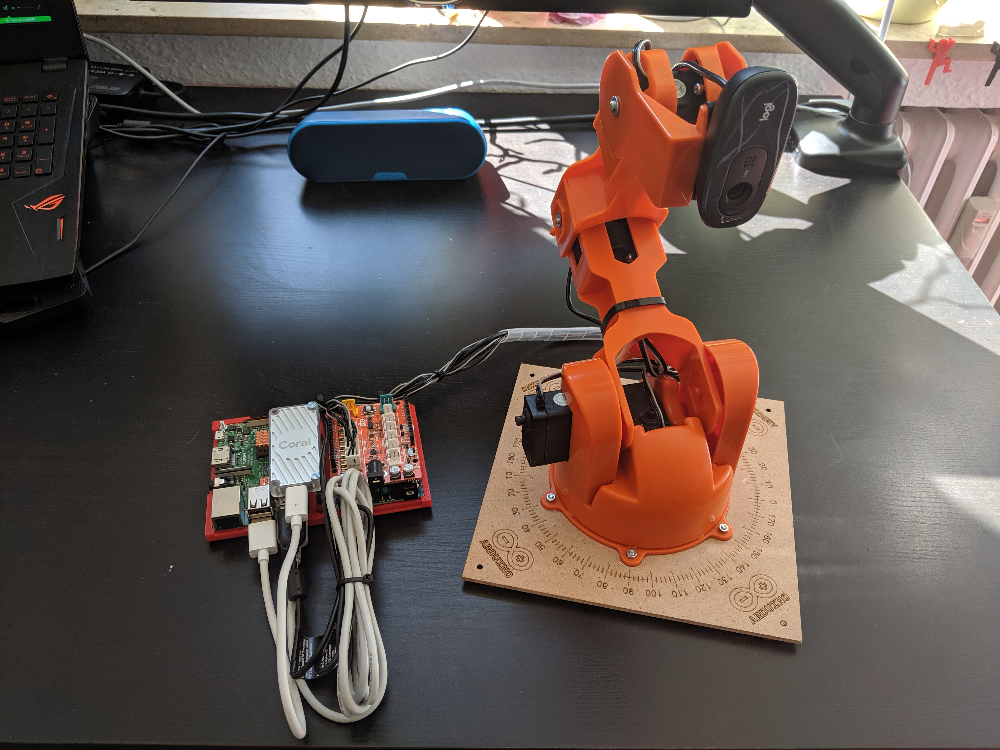

Project's description
=====================

Using an Arduino `Tinkerkit Braccio Robot`_, `Raspberry Pi 3`_ and a `Google Coral USB Accelerator`_, it allows you to actively track and follow more that 90 different type of objects autonomously. 
It is also fully integrated in ROS (Robot Operating System) using `MoveIt`_ or a simple Joint interface, and uses state-of-the-art algorithms for object detection or classification powered by `TensorFlow Lite`_.

Detailed instructions related to robot-arm assembly, connections and electronics, software and tutorials are given in the following sections.

.. _Tinkerkit Braccio Robot: https://store.arduino.cc/tinkerkit-braccio
.. _Raspberry Pi 3: https://www.raspberrypi.org/products/raspberry-pi-3-model-b-plus/
.. _Google Coral USB Accelerator: https://coral.withgoogle.com/products/accelerator
.. _MoveIt: https://moveit.ros.org
.. _TensorFlow Lite: https://www.tensorflow.org/lite

