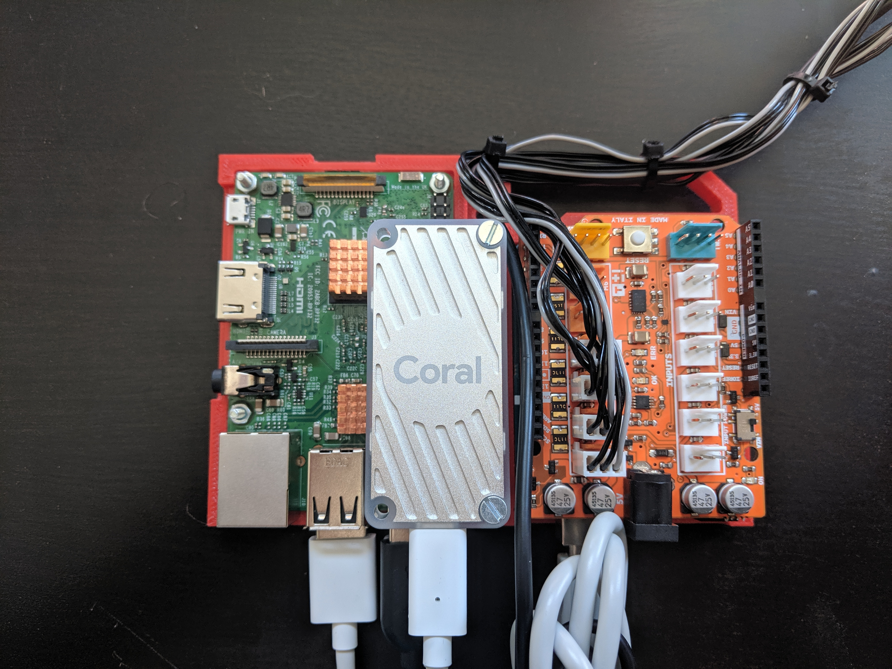
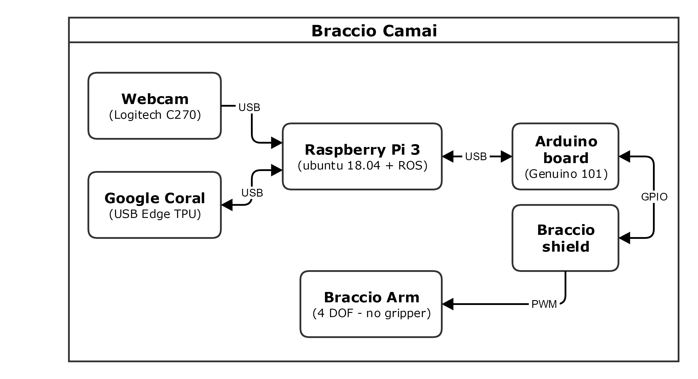

Electronics
===========

The main electronic components are:

Connection diagram of Braccio CamAI:

All main components are described as follows:

Raspberry Pi 3 Model B
^^^^^^^^^^^^^^^^^^^^^^
We use the RP3 as main processor, in charge of receiving images from the camera, process it using a Google coral USB accelerator 
and generating the corresponding Joint commands for the arm. It runs Ubuntu 18.04 and ROS Melodic.

Currently, we are using a *Raspberry Pi 3 Model B V1.2*, but the software and electronic connections are compatible with the newer version *RP3 Model B+*,
as well as previous version *Raspberry Pi 2*.

**Important:** The RP3 might get really hot. At full operation, Braccio CamAI uses approximately 65% of all CPU power. 
If you plan to have a long run-time operation, we suggest you to install an additional fan or cooling system.

A ready-to-use image will be available soon, manual instruction for installing ROS and melodic on RP3 are given as follows:

- Ubuntu 18.04 on RP3: `Ubuntu-18-04-RaspberryPI`_.

- ROS Melodic on RP3: `ROS Melodic Installation`_.

Arduino Board
^^^^^^^^^^^^^

For controlling the Braccio Arm, we use a `Genuino 101`_, but any Arduino-compatible board should works as well.

The firmware can be directly installed using the Arduino IDE: *Tools->Manage libraries* and search for *Braccio*. Please install both **Braccio** and **BraccioRobot**.

Arduino compatible Shield
^^^^^^^^^^^^^^^^^^^^^^^^^

The Braccio robot arm already includes an Arduino-shield for sending PWM commands to all servo-motors. It must be separately powered using it own power plug.
we left intentionally unconnected the motors **M5** and **M6**, since we do not want to use the gripper + last servo motor.

Google Coral USB Accelerator
^^^^^^^^^^^^^^^^^^^^^^^^^^^^

To perform object detection and classification, we have attached a Google coral USB Accelerator to the RP3. 

It has ready-to-use instructions described here: `Google Coral USB Accelerator get-started guide`_.

During installation, please remember to disable the **maximum operating frequency** or install an additional fan, because the board itself might get really hot.

.. _Ubuntu-18-04-RaspberryPI: https://wiki.ubuntu.com/ARM/RaspberryPi
.. _ROS Melodic Installation: http://wiki.ros.org/melodic/Installation/Ubuntu
.. _Genuino 101: https://store.arduino.cc/genuino-101
.. _Google Coral USB Accelerator get-started guide: https://coral.withgoogle.com/docs/accelerator/get-started/
